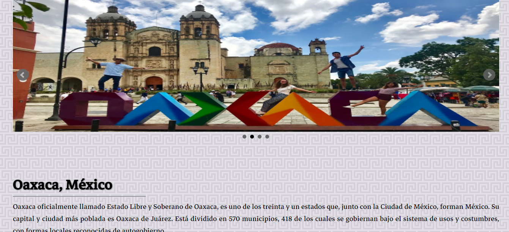
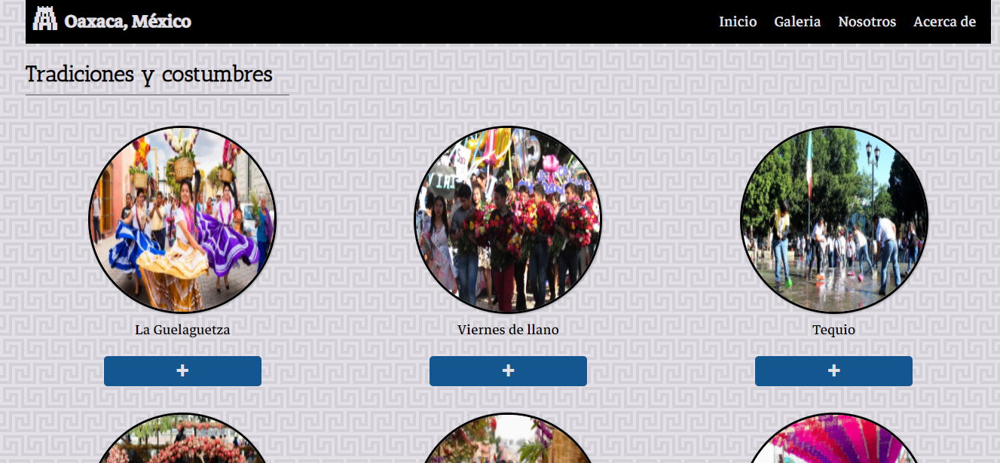
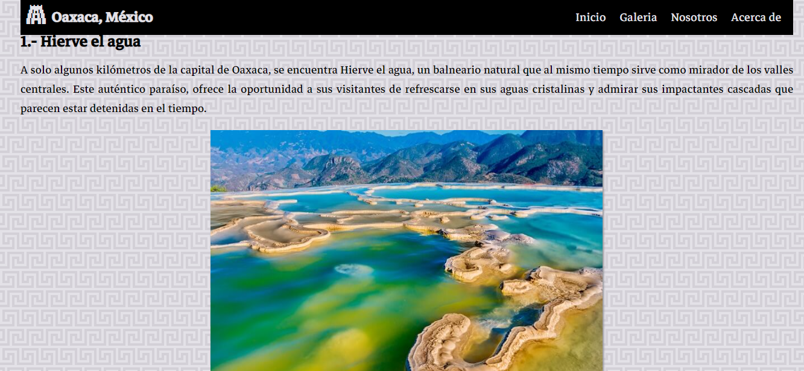
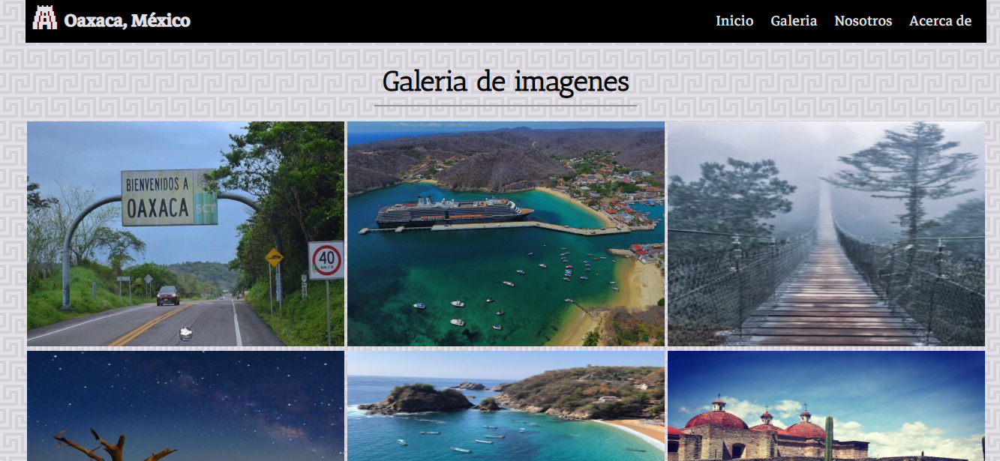
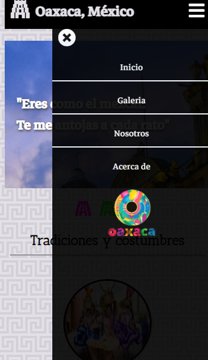
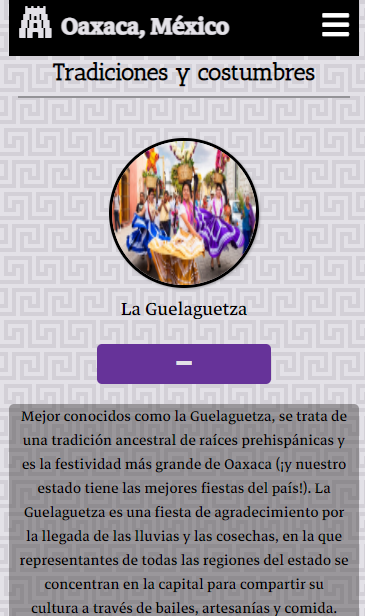

# Oxaca

Página web informativa sobre el estado de Oaxaca, esta página es estática ya que su contenido está centrado en el mismo HTML

## Tradiciones y costumbres

 
## Lugares para visitar

## Galería
Con la librería LightBox de JavaScript se puede construir una galería de manera muy rápida

## Responsivo
La página es adaptable a cualquier a diferentes tamaños de pantalla 

